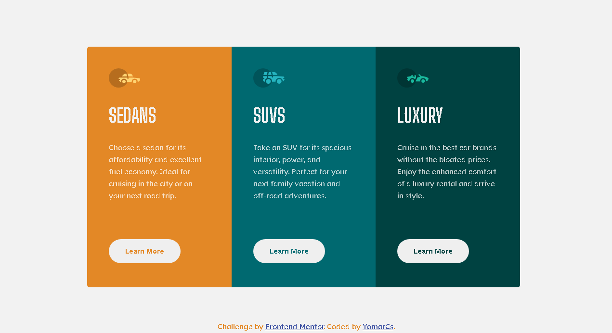

# 3-column preview card component solution

Live Site URL: [https://yomarcs.github.io/column-preview-card/](https://yomarcs.github.io/column-preview-card/)

This is a solution to the [3-column preview card component challenge on Frontend Mentor](https://www.frontendmentor.io/challenges/3column-preview-card-component-pH92eAR2-). Frontend Mentor challenges help you improve your coding skills by building realistic projects. 

## Table of contents

- [3-column preview card component solution](#3-column-preview-card-component-solution)
  - [Table of contents](#table-of-contents)
    - [Screenshot](#screenshot)
    - [Links](#links)
    - [Built with](#built-with)
  - [Author](#author)

### Screenshot

### Links

- Solution URL: [https://github.com/yomarcs/column-preview-card/blob/main/index.html](https://github.com/yomarcs/column-preview-card/blob/main/V2)
- Live Site URL: [https://yomarcs.github.io/column-preview-card/](https://yomarcs.github.io/column-preview-card/)

### Built with

- Semantic HTML5 markup
- CSS custom properties
- Mobile-first workflow
- Sass
- Flexbox

## Author

- Frontend Mentor - [@yomarcs](https://www.frontendmentor.io/profile/yomarcs)
- Github - [@yomarcs](https://github.com/yomarcs)

